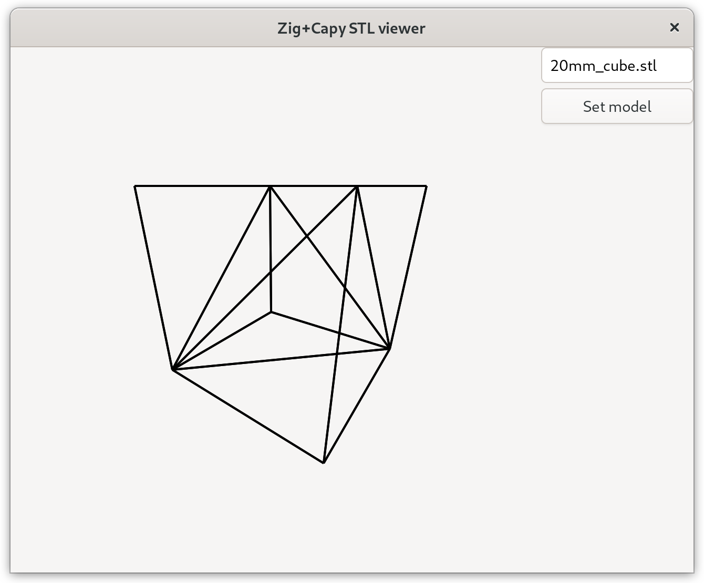

# capy-stl-viewer
little precursor project for my 3d printing slicer written in zig, this is a zig/capy app for rendering wireframes of stl files on a capy canvas.

## Usage
`zig build run`, enter path for stl file (relative to your cwd), press "Set model", use left mouse button + drag to move the camera in x,y, use right mouse button + drag to change the angle of the camera.

## Notes
- thanks to https://gamedev.stackexchange.com/a/25588 for the base projection code
- the renderer is not very optimized, and may struggle with large meshes. that is however not its usecase so for now im keeping it simple
